## 멀티 클라우드 서비스 공통 플랫폼 요구사항 정의서  (버전 0.8)                      

#### Update 일자
  -  **2021.03.22.**

#### 작성자
  - #### **Cloud-Barista 커뮤니티**
  -  **한국전자통신연구원 클라우드기반SW연구실**
  -  **메가존클라우드㈜**
  -  **㈜이노그리드**
  -  **아콘소프트**
  -  **(사)한국클라우드산업협회**
  -  **한국클라우드컴퓨팅연구조합**

 

### 문서 개정 이력

| **버전**            | **개정일자**       | **개 정 내 용**      |
| :-----------------: | :---------------: | ---------------------|
| 0.1                 | 2019.05.30.       | 1단계 기술 개발 요구사항 초안 문서   (1단계 개발 범위 : 2장 참조)  |
| 0.2                 | 2019.05.31.       | 단계별 개발 내용 보완, 사용자 정의 변경, 요구사항 보완, 양식 간소화 등 |
| 0.3  | 2019.06.18.         | 기관 검토 의견 반영                             |
| 0.4  | 2019.12.12.         | 약어 정의 및 문서 규격화 등                     |
| 0.5  | 2020.07.22.         | 사용 시나리오, 구현시기 및 주관 등              |
| 0.6  | 2020.07.23.        | 동료 검토 및 요구사항 수정 보완                 |
| 0.7  | 2020.08.24.        | 프레임워크 기술 순서 수정, 동료 검토 및 요구사항 수정 보완        |
| 0.8  | 2021.03.22.        | 연동 이력 및 가상 클라우드 환경 제공 관련 요구사항 추가        |

 

### 목 차 (바로가기)

[1. 개요](#1-개요)

- [1.1. 문서의 목적](#11-문서의-목적)
- [1.2. 문서의 범위](#12-문서의-범위)
- [1.3. 약어 정의](#13-약어-정의)
- [1.4. 참고 문헌](#14-참고-문헌)

[2. 멀티 클라우드 서비스 공통 플랫폼 개요](#2-멀티-클라우드-서비스-공통-플랫폼-개요)

[3. 사용자 정의](#3-사용자-정의)

[4. 사용 시나리오](#4-사용-시나리오)
- [4.1. 멀티 클라우드 연동 정보 등록 시나리오](#41-멀티-클라우드-연동-정보-등록-시나리오)
- [4.2. 멀티 클라우드 인프라 서비스 활용 시나리오](#42-멀티-클라우드-인프라-서비스-활용-시나리오)
- [4.3. 멀티 클라우드 애플리케이션 서비스 활용 시나리오](#43-멀티-클라우드-애플리케이션-서비스-활용-시나리오)
- [4.4. 멀티 클라우드 통합 모니터링 시나리오](#44-멀티-클라우드-통합-모니터링-시나리오)

[5. 사용자 요구사항](#5-사용자-요구사항)

[6. 시스템 요구사항](#6-시스템-요구사항)

- [6.1. 클라우드 바리스타 웹/CLI 인터페이스 기능 (WCI: Cloud-Barista Web/CLI Interface)](#61-클라우드-바리스타-웹cli-인터페이스-기능-wci-cloud-barista-webcli-interface)

- [6.2. 클라우드 바리스타 개방형 API (API: Cloud-Barista Open API)](#62-클라우드-바리스타-개방형-api-api-cloud-barista-open-api)

- [6.3. 멀티 클라우드 인프라 연동 기능 (MIF: Multi-Cloud Infrastructure Federation)](#63-멀티-클라우드-인프라-연동-기능-mif-multi-cloud-infrastructure-federation)

- [6.4. 멀티 클라우드 인프라 서비스 통합 관리 기능 (MIS: Multi-Cloud Infrastructure Service Management)](#64-멀티-클라우드-인프라-서비스-통합-관리-기능-mis-multi-cloud-infrastructure-service-management)

- [6.5. 멀티 클라우드 애플리케이션 통합 관리 (MAM: Multi-Cloud Application Management)](#65-멀티-클라우드-애플리케이션-통합-관리-mam-multi-cloud-application-management)

- [6.6. 멀티 클라우드 통합 모니터링 기능 (MSM: Multi-Cloud Service Monitoring)](#66-멀티-클라우드-통합-모니터링-기능-msm-multi-cloud-service-monitoring)

- [6.7. 클라우드 바리스타 운용 및 관리 기능 (COM: Cloud-Barista Operation and Management)](#67-클라우드-바리스타-운용-및-관리-기능-com-cloud-barista-operation-and-management)

- [6.8. 클라우드 바리스타 개발 및 시험 지원 기능 (CDT: Cloud-Barista Development and Testing Support)](#68-클라우드-바리스타-개발-및-시험-지원-기능-cdt-cloud-barista-development-and-testing-support)

 

### 1. 개요

본 문서는 "다양한 멀티 클라우드의 활용·확산을 극대화하는 멀티 클라우드 서비스 공통 플랫폼기술 개발"을 위한 사용자 및 시스템 요구사항을 정의한다.

본 장에서는 문서 작성의 목적과 범위, 약어 및 참고문헌에 대해 기술한다.

 

#### 1.1. 문서의 목적

본 문서는 사용자 요구사항을 도출하고 이에 따른 시스템 요구사항을 정의한 문서이며, 사용자와 개발 당사자 간의 시스템 개발 범위에 대한 이해 차이를 최소화하여 향후 설계 및 구현, 시험 등의 업무 관련한 기준 문서로 활용하고자 한다.

&nbsp;&nbsp;사용자 및 시스템 요구사항의 도출은 아래와 같은 활동을 통하여 수집 및 분석하였다.

-   멀티 클라우드 서비스 관련 사업자 및 협회 등 요구 분석 회의

-   멀티 클라우드 사용자의 활용 시나리오 분석

-   멀티 클라우드 관련 PoC(Proof-of-Concept) 시험 분석

-   멀티 클라우드 관련 최신 기술 분석

 

#### 1.2. 문서의 범위

본 문서의 범위는 "다양한 멀티 클라우드의 활용·확산을 극대화하는 멀티 클라우드 서비스 공통 플랫폼 기술 개발"과 관련된 멀티 클라우드 서비스 공통 플랫폼의 사용자 및 시나리오 정의, 사용자 및 시스템 요구사항 등을 기술한다.

 

#### 1.3. 약어 및 정의

| 약어 | 정의                                   |
| :--: | -------------------------------------- |
| API  | Application Programming Interface      |
| CLI  | Command-Line Interface                 |
| COM  | Cloud-Barista Operation and Management |
| CSB  | Cloud Service Brokerage Platform       |
| IoT  | Internet of Things                     |
| MCMP | Multi-Cloud Management Platform        |
| MAM  | Multi-Cloud Application Management     |
| MIF  | Multi-Cloud Infrastructure Federation  |
| MIS  | Multi-Cloud Infrastructure Service     |
| MSM  | Multi-Cloud Service Monitoring         |
| SFR  | System Function Requirements           |
| UFR  | User Function Requirements             |

 

#### 1.4. 참고 문헌

1.  멀티 클라우드 관련 PoC(Proof-of-Concept) 시험 분석:
    <https://github.com/cloud-barista/poc-farmoni>

2.  Docker-compose command-line reference:
    <https://docs.docker.com/compose/reference/>

3.  Kong Gateway Documentation: <https://docs.konghq.com/>

4.  Kubernetes Documentation: <https://kubernetes.io/docs/home/>

5.  Docker Swarm Documentation: <https://docs.docker.com/engine/swarm/>

6.  Seokho Son, Hyun-Hwa Choi, Byeong Thaek Oh, Sun Wook Kim, and Byoung Seob Kim. 2017. "Cloud SLA relationships in multi-cloud environment models and practices." In Proceedings of the 8th International Conference on Computer Modeling and Simulation (ICCMS '17).  Association for Computing Machinery, New York, NY, USA, 1--6. DOI:
    <https://doi.org/10.1145/3036331.3050422>

7.  Flexera 2020 State of the Cloud Report:
    <https://info.flexera.com/SLO-CM-REPORT-State-of-the-Cloud-2020>

8.  ISO/IEC DIS 19941, "Information Technology --- Cloud Computing --- Interoperability and Portability," ISO/IEC.
    <https://www.iso.org/standard/66639.html>

 

### 2. 멀티 클라우드 서비스 공통 플랫폼 개요

최근 대규모 컴퓨팅 인프라가 요구되는 인공지능, 빅데이터, IoT 등의 서비스들이 유연하고 탄력적인 클라우드 컴퓨팅 환경을 활용하는 추세에 있으나, 단일 클라우드의 기능 제약 및 자원 한계 문제로 이러한 대규모 서비스들의 구축 및 운영에 어려움이 있다. 대규모 복합 서비스 제공자 및 개발자들은 이와 같은 기능 제약 및 자원 한계를 극복하기 위하여 다양한 멀티 클라우드를 대상으로 최적의 컴퓨팅 인프라 환경을 구축 및 개발 중이다.

멀티 클라우드 서비스 공통 플랫폼(이하 공통 플랫폼, 코드네임: 클라우드 바리스타(Cloud-Barista)은 **그림 1**에서 보는 바와 같이 다양한 멀티 클라우드 인프라 서비스 및 멀티 클라우드 애플리케이션의 운용 및 관리에 필수적으로 요구되는 공통 기반 기술을 포함하고 있으며, 누구나 손쉽게 사용할 수 있도록 개방형 API를 제공한다. 사용자들은 멀티 클라우드 서비스 및 애플리케이션에 공통으로 필요한 기능들을 중복으로 개발해야 하는 비효율성을 제거함으로써 생산성을 크게 향상할 수 있으며 다양한 산업 및 서비스 분야에서 멀티 클라우드 활용이 가능하다.

   

  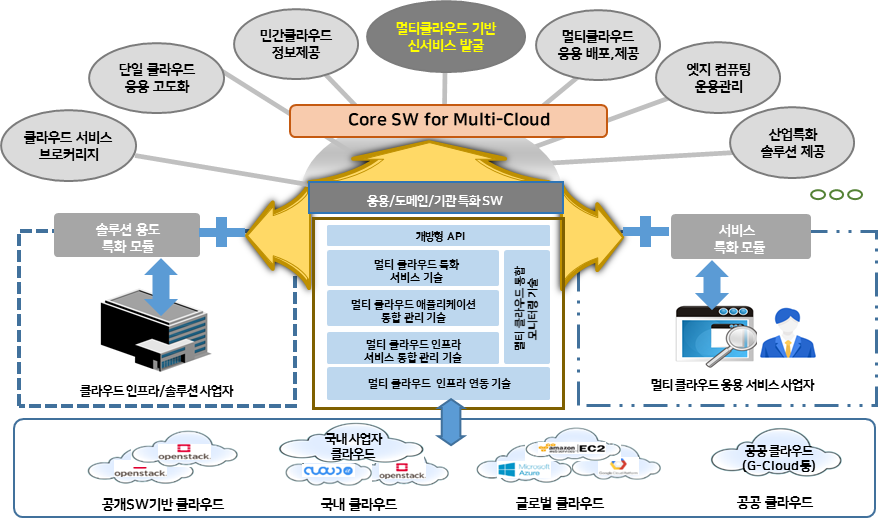  
  <b>그림 1: 멀티 클라우드 서비스 공통 플랫폼 개념도</b>

 

멀티 클라우드 서비스 공통 플랫폼 기술 개발은 **그림 2(a)** 에서 보는 바와 같이 총 2단계로 구성되며, 단계별 개발 내용은 다음과 같다.

- 1단계 개발 범위: 멀티 클라우드 인프라 서비스 통합 관리 기술 개발
  - 인프라 연동 프레임워크
  - 인프라 서비스 통합 관리 프레임워크
  - 애플리케이션 통합 관리 개념 수립 및 프로토타입
  - 통합 모니터링 프레임워크
  - 공통 플랫폼 확장형 아키텍쳐 및 운용관리
  - 웹/CLI 인터페이스 및 개방형 API

- 2단계 개발 범위: 멀티 클라우드 애플리케이션 통합 관리 기술 개발
  - 1단계 결과물 기능 확장 및 안정화  
  - 애플리케이션 통합 관리 프레임워크  
  - 멀티 클라우드 특화 서비스
  

 

  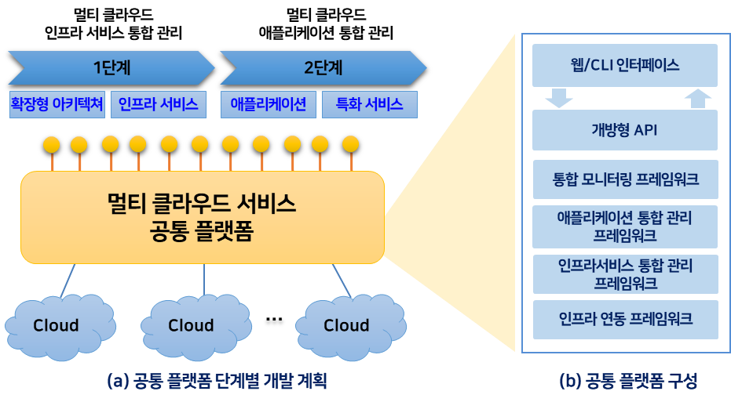 
  <b>그림 2: 멀티 클라우드 서비스 공통 플랫폼 단계별 개발 계획 및 구성</b>

    

멀티 클라우드 서비스 공통 플랫폼의 내부 프레임워크 구성은 **그림 2 (b)** 와 같고, 개별 프레임워크별로 제공하는 주요 기능은 다음과 같다.

- 멀티 클라우드 인프라 연동 프레임워크: 이종의 멀티 클라우드 인프라를 연동하고 동일 방법으로 관리 및 제어

- 멀티 클라우드 인프라 서비스 통합 관리 프레임워크: 멀티 클라우드 인프라 서비스의 운용 및 통합 관리

- 멀티 클라우드 애플리케이션 통합 관리 프레임워크: 멀티 클라우드 애플리케이션의 운용 및 통합 관리

- 멀티 클라우드 통합 모니터링 프레임워크: 인프라 서비스 및 애플리케이션의 모니터링 정보를 수집하고 제공

- 개방형 API: 멀티 클라우드 서비스 공통 플랫폼을 활용하여 다양한 SW 개발이 가능한 개방형 API 제공

- 웹/CLI 인터페이스: 멀티 클라우드 서비스 공통 플랫폼 운영 및 관리 편의를 위한 웹 인터페이스 및 CLI 인터페이스 제공
    

   

### 3. 사용자 정의

멀티 클라우드 서비스 공통 플랫폼의 사용자는 다음과 같이 정의한다.(**그림 3** 참조)

- 사용자
  - 웹 인터페이스 및 CLI 인터페이스를 통해 공통 플랫폼 기능을 사용하는 사용자  
  - 개방형 API를 통해 공통 플랫폼 기능을 활용하는 타 플랫폼 및 SW  
     &#8251; 공통 플랫폼: 동시성 제어가 가능한 단일 사용자 계정 제공
     

 

  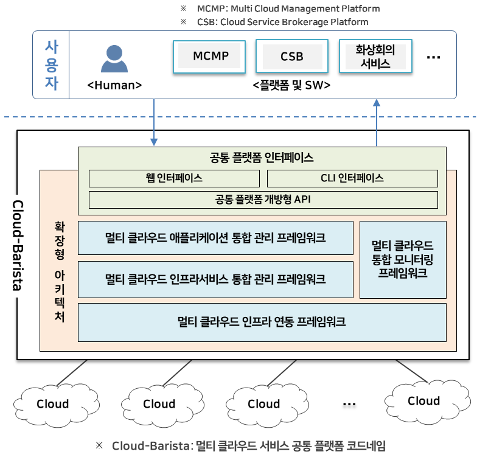  
  <b>그림 3: 멀티 클라우드 서비스 공통 플랫폼 제공 인터페이스 및 사용자</b>

 

### 4. 사용 시나리오

본 장에서는 사용자가 멀티 클라우드 서비스 공통 플랫폼을 사용하는
대표적인 시나리오를 기술한다. 주요 사용 시나리오는 **그림 4**에서 보는
바와 같이 멀티 클라우드 연동 정보 등록 시나리오, 멀티 클라우드 인프라
서비스 활용 시나리오, 멀티 클라우드 애플리케이션 서비스 활용 시나리오 및
멀티 클라우드 통합 모니터링 시나리오로 구성되며, 세부 내용은 다음과
같다.

 

  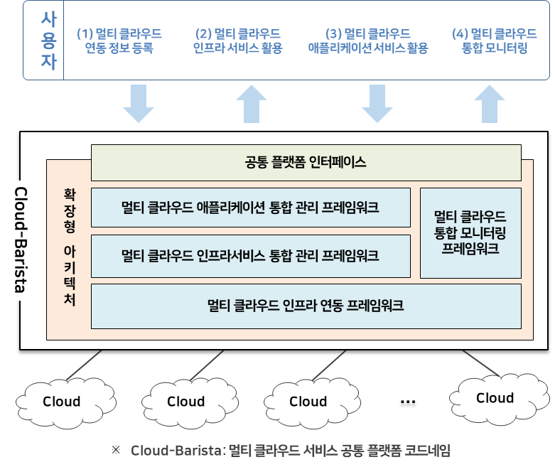  
  <b>그림 4: 멀티 클라우드 서비스 공통 플랫폼 주요 사용자 시나리오</b>

 

#### 4.1. 멀티 클라우드 연동 정보 등록 시나리오

사용자는 멀티 클라우드 인프라 서비스 및 애플리케이션 실행 등을 위한 대상
클라우드의 연동 정보 등록이 필요하며, 세부 시나리오는 **그림 5** 및 다음과 같다.

>(1) VM연동 대상 클라우드 드라이버 개발 및 등록
>- 멀티 클라우드 서비스 공통 플랫폼에 연동하고자 하는 대상 클라우드 전용 클라우드 연동 드라이버를 개발하고 이에 대한 정보를 등록한다.
>
>(2) 연동 대상 클라우드 연결 정보 등록
>- 대상 클라우드 연결을 위한 크리덴셜(Credential) 또는 비밀번호 등 연결을 위한 정보를 등록한다.
>
>(3) 연동 대상 클라우드 리전(Region) 정보 등록
>- 대상 클라우드 서비스의 리전 및 존(Zone) 등 활용하고자 하는 클라우드 리전 정보를 등록한다.
>
>(4) 멀티 클라우드 연동 정보 등록 확인
>- 사용자가 등록한 연동 정보들을 조회 및 확인한다.

 

  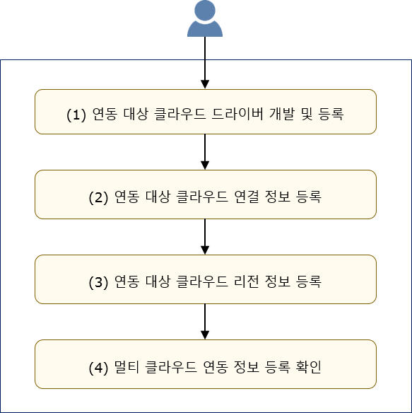  
  <b>그림 5: 멀티 클라우드 연동 정보 등록 시나리오</b>

 

사용자에 의해 등록된 멀티 클라우드 연동 정보는 대상 클라우드 연결 및
자원 생성이나 활용 시점에 활용된다.

 

#### 4.2. 멀티 클라우드 인프라 서비스 활용 시나리오

멀티 클라우드 연동 정보를 등록한 사용자는 멀티 클라우드 인프라 서비스를
활용할 수 있으며, 주요 활용 시나리오는 다음과 같다.

 

- <B>US-MIS-01: 멀티 클라우드 인프라 서비스 생성 시나리오</B>
>  사용자는 멀티 클라우드 서비스 공통 플랫폼 인터페이스를 통해서 최적의
>  멀티 클라우드 인프라 서비스를 구성 및 생성 요청하고, 생성이 완료되면
>  접속할 수 있는 정보를 제공 받는다.

 

멀티 클라우드 인프라 서비스 생성 시나리오의 세부 내용은 **그림 6** 및 다음과 같다.

>(1) 멀티 클라우드 인프라 서비스 구성
>-   사용자는 컴퓨팅 사양, 위치, 성능 등을 포함한 다양한 조건을 바탕으로
>    클라우드 서비스를 검색하고, 다수의 클라우드 서비스로 조합된 최적의
>    멀티 클라우드 인프라 서비스를 구성한다.
>
>(2) 구성된 멀티 클라우드 인프라 서비스 생성 요청
>-   사용자는 구성된 멀티 클라우드 인프라 서비스의 생성을 멀티 클라우드
>    서비스 공통 플랫폼에 요청한다.
>
>(3) 생성된 멀티 클라우드 인프라 서비스 정보 조회
>-   멀티 클라우드 서비스 공통 플랫폼은 모든 클라우드 서비스 요소를
>    하나의 멀티 클라우드 인프라 서비스 형태로 구성하여 멀티 클라우드
>    인프라 서비스 생성을 완료하고 사용자에게 구성 정보 및 접속 정보를
>    회신한다.
>
>(4) 생성된 멀티 클라우드 인프라 서비스 접속 및 사용
>-   사용자는 인터페이스를 통해 생성된 멀티 클라우드 인프라 서비스를
>    확인하고 접속(예: SSH)하여 사용한다.
>
>(5) US-MIS-02 또는 US-MIS-03 시나리오 연계
>-   멀티 클라우드 인프라 서비스 생성 후 사용자는 멀티 클라우드 인프라
>    서비스의 운용을 위해서 다음과 같은 사용자 시나리오 수행이 가능하다.
>      - US-MIS-02: 멀티 클라우드 인프라 서비스 라이프사이클 관리 시나리오
>      - US-MIS-03: 멀티 클라우드 인프라 서비스 확장 및 축소 시나리오
>
>(6) US-MSM-01 또는 US-MAM-01 시나리오 연계
>-   멀티 클라우드 인프라 서비스 생성 후 사용자는 생성된 멀티 클라우드
>    인프라 서비스에 대한 모니터링을 통해서 서비스를 운용할 수 있고, 멀티
>    클라우드 애플리케이션을 등록하여 생성된 멀티 클라우드 인프라
>    서비스를 활용하는 사용자 시나리오 수행이 가능하다.
>      - US-MSM-01: 멀티 클라우드 통합 모니터링 정보 조회 시나리오
>      - US-MAM-01: 멀티 클라우드 애플리케이션 등록 시나리오

 

  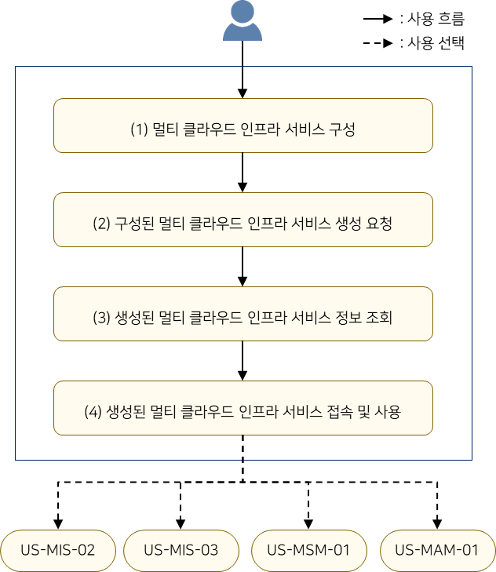  
  <b>그림 6: 멀티 클라우드 인프라 서비스 생성 시나리오</b>

 

- <B>US-MIS-02: 멀티 클라우드 인프라 서비스 라이프사이클 관리 시나리오</B>

>  사용자는 멀티 클라우드 서비스 공통 플랫폼을 통해 생성된 멀티 클라우드
>  인프라 서비스의 라이프사이클 상태를 조회하고 중지, 재개, 재시작 및 삭제
>  등을 제어할 수 있다. 또한, 사용자는 멀티 클라우드 인프라 서비스 내부에
>  포함된 인스턴스들을 개별적으로 확인 및 제어할 수도 있다.

 

멀티 클라우드 인프라 서비스 라이프사이클 관리 시나리오의 세부 내용은 **그림 7** 및 다음과 같다.

>(1) 멀티 클라우드 인프라 서비스 상태 조회
>-   사용자는 특정 멀티 클라우드 인프라 서비스의 라이프사이클 상태를
>    조회한다.
>
>(2) 멀티 클라우드 인프라 서비스 라이프사이클 제어 요청
>-   사용자는 해당 멀티 클라우드 인프라 서비스에 대해 제어(중지, 재개,
>    재시작, 삭제 등)를 멀티 클라우드 서비스 공통 플랫폼에 요청한다.
>
>(3) 멀티 클라우드 인프라 서비스 제어 상태 확인
>-   사용자는 해당 멀티 클라우드 인프라 서비스 상태 조회를 통해서 해당
>    서비스의 제어가 완료된 것을 확인한다.

 

  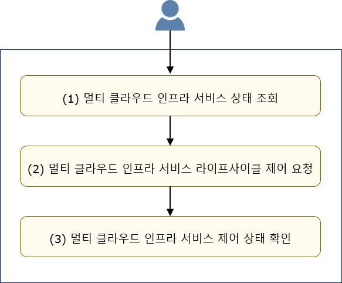  
  <b>그림 7: 멀티 클라우드 인프라 서비스 라이프사이클 관리 시나리오</b>

 

- <B>US-MIS-03: 멀티 클라우드 인프라 서비스 확장 및 축소 시나리오</B>

>  사용자는 서비스 부하 상황에 따라 운영 중인 멀티 클라우드 인프라
>  서비스의 규모를 확장 및 축소할 수 있다.

 

멀티 클라우드 인프라 서비스 확장 및 축소 시나리오의 세부 내용은 **그림 8** 및 다음과 같다.

>(1) 멀티 클라우드 인프라 서비스 조회
>-   사용자는 특정 멀티 클라우드 인프라 서비스의 구성 및 상태를 조회한다.
>
>(2) 멀티 클라우드 인프라 서비스 확장 또는 축소 요청
>-   사용자는 해당 멀티 클라우드 인프라 서비스에 대해, 대상 인스턴스를
>    선택 후 축소 또는 클라우드 서비스 사양을 선택 후 확대를 멀티
>    클라우드 서비스 공통 플랫폼에 요청한다.
>
>(3) 멀티 클라우드 인프라 서비스 구성 확인
>-   사용자는 해당 멀티 클라우드 인프라 서비스 조회를 통해서 확대 또는
>    축소 요청이 적용된 것을 확인한다.

 

  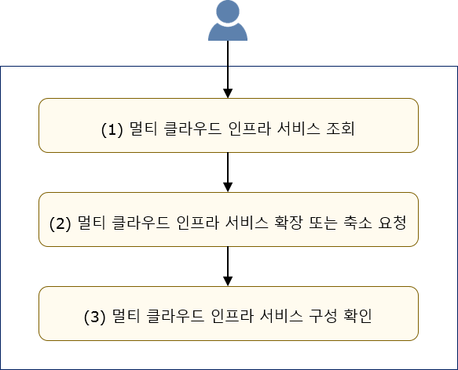  
  <b>그림 8: 멀티 클라우드 인프라 서비스 확장 및 축소 시나리오</b>

 

#### 4.3. 멀티 클라우드 애플리케이션 서비스 활용 시나리오

멀티 클라우드 연동 정보를 등록한 사용자는 사용자의 멀티 클라우드
애플리케이션을 실행 요청할 수 있으며, 주요 활용 시나리오는 다음과 같다.

- <B>US-MAM-01: 멀티 클라우드 애플리케이션 등록 시나리오</B>

>  멀티 클라우드 애플리케이션의 실행을 요청하기 위해서는 먼저 단위
>  애플리케이션들을 등록하고, 등록된 단위 애플리케이션들을 활용하여 멀티
>  클라우드 애플리케이션 구성을 정의하고 관련 요구사항의 등록이 필요하다.

 

멀티 클라우드 애플리케이션 등록 시나리오의 세부 내용은 **그림 9** 및 다음과 같다.

>(1) 멀티 클라우드 애플리케이션 이미지 등록
>-   사용자는 멀티 클라우드 애플리케이션을 구성할 수 있는 단위
>    애플리케이션을 멀티 클라우드 서비스 공통 플랫폼에 등록한다.
>
>(2) 멀티 클라우드 애플리케이션 구성 및 요구사항 등록
>-   등록된 단위 애플리케이션들 중 어떤 단위 애플리케이션이 포함되는지
>    또는 선후 실행 관계 등의 정의를 통해 멀티 클라우드 애플리케이션을
>    구성하고, 각 단위 애플리케이션의 구동을 위해 필요한 CPU, 메모리,
>    포트 정보 등 자원 요구사항을 등록한다.
>
>(3) 멀티 클라우드 애플리케이션 구성 확인
>-   사용자는 해당 멀티 클라우드 애플리케이션 등록 여부 및 구성 상태를
>    확인할 수 있다.
>
>(4) 시나리오 연계
>-   멀티 클라우드 애플리케이션 등록 후 사용자는 다음과 같은 사용자
>    시나리오 수행이 가능하다.
>     - US-MAM-02: 멀티 클라우드 애플리케이션 실행 제어 시나리오

 

  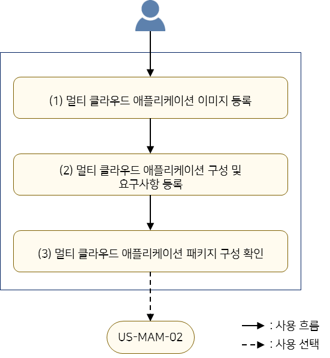  
  <b>그림 9: 멀티 클라우드 애플리케이션 등록 시나리오</b>

 

- <B>US-MAM-02: 멀티 클라우드 애플리케이션 실행 제어 시나리오</B>

>  사용자는 등록한 멀티 클라우드 애플리케이션에 대한 일시 정지, 종료 등의
>  라이프사이클 제어가 가능하며, 실행 중인 멀티 클라우드 애플리케이션 상태
>  및 실행 환경을 모니터링할 수 있다. 또한, 멀티 클라우드 서비스 공통
>  플랫폼은 안정적인 사용자의 애플리케이션 수행을 위해서 오토 스케일링 등
>  자동 관리 기능을 제공한다.

 

멀티 클라우드 애플리케이션 제어 시나리오의 세부 내용은 **그림 10** 및 다음과 같다.

>(1) 멀티 클라우드 애플리케이션 실행 요청
>-   사용자는 사전 등록한 멀티 클라우드 애플리케이션의 실행을 요청한다.
>
>(2) 멀티 클라우드 애플리케이션 모니터링(실행환경, App 자체)
>-   사용자는 실행된 멀티 클라우드 애플리케이션의 상태 및 단위
>    애플리케이션들의 실행 환경 상태 모니터링 정보를 조회할 수 있다.
>
>(3) 멀티 클라우드 애플리케이션 라이프사이클 제어
>-   사용자는 멀티 클라우드 애플리케이션의 라이프사이클(정지, 재시작 등)을 제어할 수 있다.
>
>(4) 멀티 클라우드 애플리케이션 종료
>-   사용자는 실행 중인 멀티 클라우드 애플리케이션 종료를 요청하고 결과를 확인한다.

 

  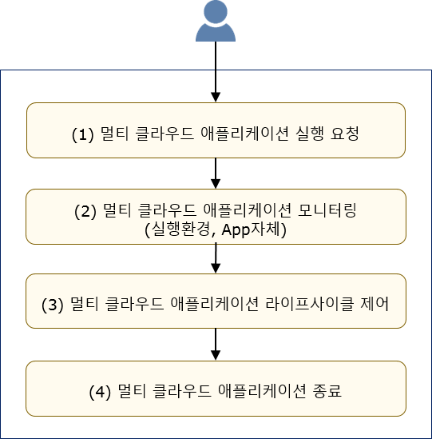  
  <b>그림 10: 멀티 클라우드 애플리케이션 제어 시나리오</b>

 

#### 4.4. 멀티 클라우드 통합 모니터링 시나리오

- <B>US-MSM-01: 멀티 클라우드 통합 모니터링 정보 조회 시나리오</B>

> 사용자는 멀티 클라우드 서비스 공통 플랫폼 인터페이스를 통해서 실행 중인
> 멀티 클라우드 인프라 및 멀티 클라우드 애플리케이션에 대한 모니터링
> 여부를 설정할 수 있으며, 통합 모니터링 메트릭 정보를 조회할 수 있다.

 

멀티 클라우드 통합 모니터링 정보 조회 시나리오의 세부 내용은 **그림 11** 및 다음과 같다.

>(1) 특정 멀티 클라우드 인프라 또는 멀티 클라우드 애플리케이션에 대한 모니터링 설정 요청
>-   사용자는 실행 중인 멀티 클라우드 인프라 또는 멀티 클라우드
>    애플리케이션에 대한 모니터링 가동 설정을 요청한다.
>
>(2) 멀티 클라우드 통합 모니터링 정보 조회
>-   사용자는 모니터링 가동을 설정한 멀티 클라우드 인프라 또는 멀티
>    클라우드 애플리케이션에 대하여 수집된 통합 모니터링 정보를 조회할 수 있다.

 

  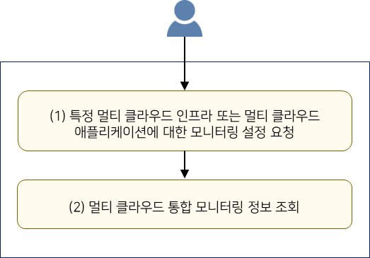  
  <b>그림 11: 멀티 클라우드 통합 모니터링 정보 조회 시나리오</b>

 

- <B>US-MSM-02: 멀티 클라우드 모니터링 알람 정보 조회 시나리오</B>

>  사용자는 멀티 클라우드 서비스 공통 플랫폼 인터페이스를 통해서 운영 중인
>  멀티 클라우드 인프라 및 멀티 클라우드 애플리케이션에 대한 모니터링 알람
>  조건을 설정할 수 있으며, 모니터링 결과에 대한 알람 정보를 조회할 수 있다.

 

멀티 클라우드 모니터링 알람 정보 조회 시나리오의 세부 내용은 **그림 12** 및 다음과 같다.

>(1) 멀티 클라우드 인프라 또는 멀티 클라우드 애플리케이션에 대한 알람 설정
>-   사용자는 운영 중인 멀티 클라우드 인프라 또는 멀티 클라우드
>    애플리케이션에 대한 알람 정보 수신을 위한 특정 조건 설정을 요청한다.
>
>(2) 멀티 클라우드 모니터링 알람 정보 조회
>-   사용자는 모니터링 가동을 설정한 멀티 클라우드 인프라 또는 멀티
>    클라우드 애플리케이션에 대한 알람 정보를 조회한다.

 

  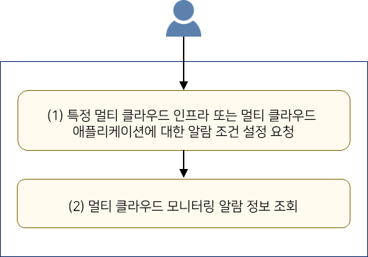  
  <b>그림 12: 멀티 클라우드 모니터링 알람 정보 조회 시나리오</b>

 

- <B>US-MSM-03: 요구 시점 멀티 클라우드 모니터링 정보 조회 시나리오</B>

>  사용자는 멀티 클라우드 서비스 공통 플랫폼 인터페이스를 통해서 운영 중인
>  멀티 클라우드 인프라 및 멀티 클라우드 애플리케이션에 대해 특정 시점의
>  모니터링을 요청할 수 있으며, 해당 시점의 모니터링 결과를 조회할 수 있다.

 

요구 시점 멀티 클라우드 모니터링 정보 조회 시나리오의 세부 내용은 **그림 13** 및 다음과 같다.

>(1) 멀티 클라우드 인프라 또는 멀티 클라우드 애플리케이션에 대한 특정 시점 모니터링 요청
>-   사용자는 운영 중인 멀티 클라우드 인프라 또는 멀티 클라우드
>    애플리케이션에 대한 특정 시점 모니터링 수행을 요청한다.
>
>(2) 요구 시점 멀티 클라우드 모니터링 결과 조회
>-   사용자는 멀티 클라우드 인프라 또는 멀티 클라우드 애플리케이션의 특정
>    시점에 대한 모니터링 결과를 조회한다.

 

  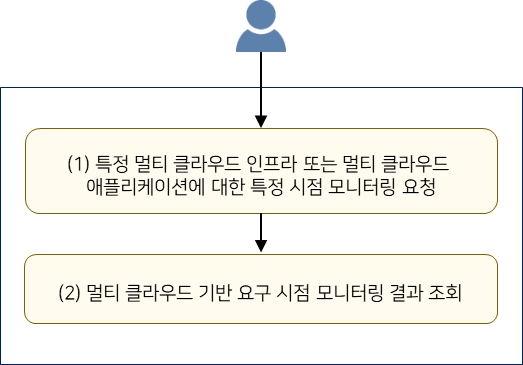  
  <b>그림 13: 요구 시점 멀티 클라우드 모니터링 정보 조회 시나리오</b>

 

### 5. 사용자 요구사항

멀티 클라우드 관련 기술 및 사용자 요구 분석 등을 통해 수집 분석한 멀티
클라우드 서비스 공통 플랫폼의 사용자 요구사항은 표 1과 같다.

 

  <b>표 1: 멀티 클라우드 서비스 공통 플랫폼 사용자 요구사항</b> 

| 요구사항 ID | 상 세 내 용                                               |
| :--------: | --------------------------------------------------------- |
| UFR-01  | 멀티 클라우드 서비스 공통 플랫폼의 운영 및 관리 편의를 위한 인터페이스를 제공해야 한다. |
| UFR-02  | 공통 플랫폼을 활용하여 다양한 SW 개발이 가능하도록 개방형 API를 제공해야 한다.         |
| UFR-03  | 다양한 멀티 클라우드 인프라를 동적으로 연동할 수 있어야 한다.                       |
| UFR-04  | 이종 멀티 클라우드 인프라를 동일한 인터페이스로 연결 및 제어할 수 있어야 한다.       |
| UFR-05  | 다양한 개별 클라우드 인프라 서비스를 통합한 멀티 클라우드 인프라 서비스를 제공해야 한다. |
| UFR-06  | 사용자 요청에 따라 최적의 멀티 클라우드 인프라 서비스를 제공해야 한다.    |
| UFR-07  | 멀티 클라우드 인프라 서비스의 상태 및 운용 정보를 제공해야 한다.      |
| UFR-08  | 멀티 클라우드 인프라 상에서 애플리케이션 서비스를 제공해야 한다.   |
| UFR-09  | 멀티 클라우드 인프라 서비스 및 애플리케이션 운영 관리에 필요한 모니터링 정보를 제공해야 한다.     |
| URF-10  | 대규모 멀티 클라우드 인프라 서비스 및 애플리케이션에 대한 모니터링 정보를 주기적으로 수집 및 제공해야 한다. |
| UFR-11  | 멀티 클라우드 인프라 서비스 및 애플리케이션의 모니터링 정보 요청 시 요구 시점의 모니터링 정보를 제공해야 한다. |
| UFR-12  | 공통 플랫폼의 기능 확장 및 추가가 용이한 확장 가능한 공통 프레임워크 아키텍처를 제공해야 한다.               |
| UFR-13  | 멀티 클라우드 서비스 공통 플랫폼을 손쉽게 운용 및 관리할 수 있어야 한다.  |
| UFR-14  | 멀티 클라우드 인프라 활용 정책 수립 등에 활용하기 위하여 멀티 클라우드 인프라 연동 이력 정보를 제공해야 한다. |
| UFR-15  | 멀티 클라우드 서비스 공통 플랫폼의 개발 및 시험 편의성을 위하여 가상의 클라우드 환경을 제공해야 한다. |

 

### 6. 시스템 요구사항

본 장에서는 5. 장의 수집된 사용자 요구사항을 만족시키기 위한 시스템
요구사항 분석 결과를 기술한다. 본 시스템 요구사항은 시스템 상세 설계 및
구현 시 반드시 고려되어야 한다.

#### 6.1. 클라우드 바리스타 웹/CLI 인터페이스 기능 (WCI: Cloud-Barista Web/CLI Interface)

 

  <b>표 2: 클라우드 바리스타 웹/CLI 인터페이스 기능 시스템 요구사항</b> 

|  요구사항 ID  |상 세 내 용 |  관련 요구사항  |   구현 시기  |  주관 |
| :----------: | ---------- |:-------------: | :---------: | :---: | 
| SFR-WCI-01 | 멀티 클라우드 인프라 연동 프레임워크 사용을 위한  웹기반의 GUI 및 CLI 도구를 제공해야 한다. | UFR-01 |   '19 ~ '20 | 메가존클라우드 |
| SFR-WCI-02 | 멀티 클라우드 인프라 서비스 운용 및 통합 관리 프레임워크  사용을 위한 웹기반의 GUI 및 CLI 도구를 제공해야 한다. | UFR-01 | '19 ~ '20 | 메가존클라우드 |
| SFR-WCI-03 | 멀티 클라우드 통합 모니터링 프레임워크 사용을 위한  웹기반의 GUI 및 CLI 도구를 제공해야 한다. | UFR-01 | '19 ~ '22 | 메가존클라우드 |
| SFR-WCI-04 | 멀티 클라우드 애플리케이션 통합 관리 프레임워크의 사용을  위한 웹기반의 GUI 및 CLI 도구를 제공해야 한다. | UFR-01 |'21 ~ '22 | 메가존클라우드 |                        

 

#### 6.2. 클라우드 바리스타 개방형 API (API: Cloud-Barista Open API)

표 3: 클라우드 바리스타 개방형 API 기능 시스템 요구사항

+----------+--------------------------------+--------+--------+--------+
| 요구사항 | 상 세 내 용                    | 관련\  | 구현   | 주관   |
| ID       |                                | 요     | 시기   |        |
|          |                                | 구사항 |        |        |
+==========+================================+========+========+========+
| SF       | 멀티 클라우드 서비스 공통      | UFR-02 | '20    | ETRI   |
| R-API-01 | 플랫폼 개방형 API의 서버 연결  |        |        |        |
|          | 인증 방법을 제공해야 한다.     |        |        |        |
+----------+--------------------------------+--------+--------+--------+
| SF       | 멀티 클라우드 인프라 연동      | UFR-02 | \'19   | ETRI   |
| R-API-02 | 프레임워크 사용을 위한 개방형  |        | \~\'20 |        |
|          | API를 제공해야 한다.           |        |        |        |
+----------+--------------------------------+--------+--------+--------+
| SF       | 멀티 클라우드 인프라 서비스    | UFR-02 | \'19   | ETRI   |
| R-API-03 | 운용 및 통합 관리 프레임워크   |        | \~\'20 |        |
|          | 사용을 위한 개방형 API를       |        |        |        |
|          | 제공해야 한다.                 |        |        |        |
+----------+--------------------------------+--------+--------+--------+
| SF       | 멀티 클라우드 통합 모니터링    | UFR-02 | \'19   | ETRI,\ |
| R-API-04 | 프레임워크 사용을 위한 개방형  |        | \~\'21 | 이노   |
|          | API를 제공해야 한다.           |        |        | 그리드 |
+----------+--------------------------------+--------+--------+--------+
| SF       | 멀티 클라우드 애플리케이션     | UFR-02 | \'20   | ETRI,  |
| R-API-05 | 통합 관리 프레임워크 사용을    |        | \~\'21 |        |
|          | 위한 개방형 API를 제공해야     |        |        | 아콘   |
|          | 한다.                          |        |        | 소프트 |
+----------+--------------------------------+--------+--------+--------+

#### 6.3. 멀티 클라우드 인프라 연동 기능 (MIF: Multi-Cloud Infrastructure Federation)

표 4: 멀티 클라우드 인프라 연동 기능 시스템 요구사항

+----------+--------------------------------+--------+--------+--------+
| 요구사항 | 상 세 내 용                    | 관련\  | 구현   | 주관   |
| ID       |                                | 요     | 시기   |        |
|          |                                | 구사항 |        |        |
+==========+================================+========+========+========+
| SF       | 다양한 클라우드 인프라 연결을  | UFR-04 | \'19   | ETRI,  |
| R-MIF-01 | 위한 설정 정보(크리덴셜, 리전  |        | \~\'20 |        |
|          | 등) 관리 방법을 제공해야 한다. |        |        | 이노그 |
|          |                                |        |        | 리드,  |
|          |                                |        |        |        |
|          |                                |        |        | 메     |
|          |                                |        |        | 가존클 |
|          |                                |        |        | 라우드 |
+----------+--------------------------------+--------+--------+--------+
| SF       | 이종의 클라우드 인프라들을     | U      | '1     | ETRI,  |
| R-MIF-02 | 단일 방식으로 연동 및 제어할   | FR-03, | 9\~'22 |        |
|          | 수 있는 클라우드 드라이버      | UFR-04 |        | 이노그 |
|          | 인터페이스 및 드라이버를       |        |        | 리드,  |
|          | 제공해야 한다.                 |        |        |        |
|          |                                |        |        | 메     |
|          |                                |        |        | 가존클 |
|          |                                |        |        | 라우드 |
+----------+--------------------------------+--------+--------+--------+
| SF       | 멀티 클라우드 인프라를         | UFR-03 | '19    | ETRI   |
| R-MIF-03 | 동적으로 연동 가능한 구조를    |        |        |        |
|          | 제공해야 한다.                 |        |        |        |
+----------+--------------------------------+--------+--------+--------+
| SF       | 연동된 클라우드 인프라의       | UFR-14 | '2     | ETRI   |
| R-MIF-04 | 제어를 위한 API 호출 이력      |        | 0\~'21 |        |
|          | 정보(대상 리전, 대상 자원,     |        |        |        |
|          | 대상 API 및 실행 소요 시간     |        |        |        |
|          | 등)를 수집 및 제공해야 한다.   |        |        |        |
+----------+--------------------------------+--------+--------+--------+

#### 6.4. 멀티 클라우드 인프라 서비스 통합 관리 기능 (MIS: Multi-Cloud Infrastructure Service Management)

표 5: 멀티 클라우드 인프라 서비스 기능 시스템 요구사항

-----------------------------------------------------------------------------
  요구사항 ID  상 세 내 용                       관련\      구현 시기  주관
                                                 요구사항              
------------ --------------------------------- ---------- ---------- --------
  SFR-MIS-01   멀티 클라우드 인프라 서비스의     UFR-06     '19\~'22   ETRI
               최적 배치 스케줄링 정책을                               
               제공해야 한다.                                          

  SFR-MIS-02   배치 스케줄링 정책에 따라 멀티    UFR-06     '19\~'21   ETRI
               클라우드 인프라 서비스를 생성 및                        
               실행할 수 있어야 한다.                                  

  SFR-MIS-03   멀티 클라우드 인프라 서비스의     UFR-07     '19\~'20   ETRI
               정보를 저장 및 관리할 수 있어야                         
               한다.                                                   

  SFR-MIS-04   멀티 클라우드 인프라 서비스의     UFR-05     '19\~'20   ETRI
               생성, 실행 및 종료 등                                   
               라이프사이클을 관리할 수 있어야                         
               한다.                                                   

  SFR-MIS-05   멀티 클라우드 인프라 서비스의     UFR-07     '20\~'22   ETRI
               품질 관리를 위해서 사용자 정책에                        
               따라 상태 판단 및 자동 제어할 수                        
               있어야 한다.                                            
  -----------------------------------------------------------------------------

#### 6.5. 멀티 클라우드 애플리케이션 통합 관리 (MAM: Multi-Cloud Application Management)

표 6: 멀티 클라우드 애플리케이션 통합 관리 기능 시스템 요구사항

+----------+------------------------------+-----------+--------+------+
| 요구사항 | 상 세 내 용                  | 관련\     | 구현   | 주관 |
| ID       |                              | 요구사항  | 시기   |      |
+==========+==============================+===========+========+======+
| SF       | 멀티 클라우드 인프라 상에서  | UFR-08    | '2     | E    |
| R-MAM-01 | 동작하는 애플리케이션을 위한 |           | 0\~'22 | TRI, |
|          | 실행환경을 제공해야 한다.    |           |        |      |
|          |                              |           |        | 아   |
|          |                              |           |        | 콘소 |
|          |                              |           |        | 프트 |
+----------+------------------------------+-----------+--------+------+
| SF       | 멀티 클라우드 인프라 상에서  | UFR-08    | '2     | E    |
| R-MAM-02 | 동작하는 애플리케이션을 위한 |           | 0\~'22 | TRI, |
|          | 실행환경을 제어할 수 있어야  |           |        |      |
|          | 한다.                        |           |        | 아   |
|          |                              |           |        | 콘소 |
|          |                              |           |        | 프트 |
+----------+------------------------------+-----------+--------+------+
| SF       | 멀티 클라우드 인프라 상에서  | UFR-08    | '2     | E    |
| R-MAM-03 | 동작하는 애플리케이션의 성능 |           | 0\~'22 | TRI, |
|          | 및 확장성 보장을 위한        |           |        |      |
|          | 실행환경 기능을 제공해야     |           |        | 아   |
|          | 한다.                        |           |        | 콘소 |
|          |                              |           |        | 프트 |
+----------+------------------------------+-----------+--------+------+

**\
**

#### 6.6. 멀티 클라우드 통합 모니터링 기능 (MSM: Multi-Cloud Service Monitoring)

표 7: 멀티 클라우드 통합 모니터링 기능 시스템 요구사항

+----------+--------------------------------+--------+--------+--------+
| 요구사항 | 상 세 내 용                    | 관련\  | 구현   | 주관   |
| ID       |                                | 요     | 시기   |        |
|          |                                | 구사항 |        |        |
+==========+================================+========+========+========+
| SF       | 멀티 클라우드 인프라 배치      | U      | '20    | 이노   |
| R-MSM-01 | 스케줄링 및 운영 관리에 필요한 | FR-09, |        | 그리드 |
|          | 모니터링 메트릭을 제공해야     | UFR-10 |        |        |
|          | 한다.                          |        |        |        |
+----------+--------------------------------+--------+--------+--------+
| SF       | 다양한 자원에 대한 대규모      | UFR-10 | '1     | 이노   |
| R-MSM-02 | 모니터링 정보를                |        | 9\~'20 | 그리드 |
|          | 수집/저장/관리하기 위한 확장   |        |        |        |
|          | 가능한 모니터링 프레임워크     |        |        |        |
|          | 구조 및 기능을 제공해야 한다.  |        |        |        |
+----------+--------------------------------+--------+--------+--------+
| SF       | 수집된 통합 모니터링 정보를    | UFR-10 | '1     | 이노   |
| R-MSM-03 | 기반으로 모니터링 통계 정보를  |        | 9\~'20 | 그리드 |
|          | 제공해야 한다.                 |        |        |        |
+----------+--------------------------------+--------+--------+--------+
| SF       | 사용자 요구 시점의 모니터링    | UFR-11 | '20    | 이노   |
| R-MSM-04 | 정보를 제공할 수 있는 통합     |        |        | 그리드 |
|          | 모니터링 프레임워크 구조 및    |        |        |        |
|          | 기능을 제공해야 한다.          |        |        |        |
+----------+--------------------------------+--------+--------+--------+
| SF       | 모니터링 메트릭 기반 알람      | UFR-09 | '20    | 이노   |
| R-MSM-05 | 임계치 설정 및 알람 연동       |        |        | 그리드 |
|          | 기능을 제공해야 한다.          |        |        |        |
+----------+--------------------------------+--------+--------+--------+
| SF       | 멀티 클라우드 애플리케이션의   | U      | \'20   | 이노   |
| R-MSM-06 | 모니터링 정보를 수집 및        | FR-09, | \~\'21 | 그리드 |
|          | 제공해야 한다.                 |        |        |        |
|          |                                | UFR-10 |        |        |
+----------+--------------------------------+--------+--------+--------+

**\
**

#### 6.7. 클라우드 바리스타 운용 및 관리 기능 (COM: Cloud-Barista Operation and Management)

표 8: 멀티 클라우드 서비스 공통 플랫폼 운용 관리 기능 시스템 요구사항

-------------------------------------------------------------------------------
  요구사항 ID  상 세 내 용                       관련\      구현     주관
                                                 요구사항   시기     
------------ --------------------------------- ---------- -------- ------------
  SFR-COM-01   클라우드 바리스타 구성요소        UFR-12     '20      아콘소프트
               프레임워크 간의/로의 API 호출을                       
               중계하는 기능을 제공해야 한다.                        

  SFR-COM-02   멀티 클라우드 서비스 공통 플랫폼  UFR-13     '20      ETRI
               설치 및 실행 방법을 제공해야                          
               한다.                                                 

  SFR-COM-03   멀티 클라우드 서비스 공통         UFR-13     '20      ETRI
               플랫폼을 모니터링하는 방법을                          
               제공해야 한다.                                        

  SFR-COM-04   멀티 클라우드 서비스 공통 플랫폼  UFR-13     '20      ETRI
               구성요소에 장애 발생 시                               
               재구동시키는 방법을 제공해야                          
               한다.                                                 
  -------------------------------------------------------------------------------

**\
**

#### 6.8. 클라우드 바리스타 개발 및 시험 지원 기능 (CDT: Cloud-Barista Development and Testing Support)

표 9: 멀티 클라우드 서비스 공통 플랫폼 개발 및 시험 지원 기능 시스템
요구사항

-----------------------------------------------------------------------------
  요구사항 ID  상 세 내 용                       관련\      구현 시기  주관
                                                 요구사항              
------------ --------------------------------- ---------- ---------- --------
  SFR-CDT-01   클라우드 바라스타가 연동 가능한   UFR-15     '20\~'21   ETRI
               가상 클라우드를 제공해야 한다.                          

  SFR-CDT-02   멀티 클라우드 인프라 서비스의     UFR-15     '20\~'21   ETRI
               생성 및 제어가 가능한 가상 VM을                         
               제공해야 한다.                                          

  SFR-CDT-03   멀티 클라우드 인프라 서비스의     UFR-15     '20\~'21   ETRI
               모니터링 정보를 제공해야 한다.                          
  -----------------------------------------------------------------------------
